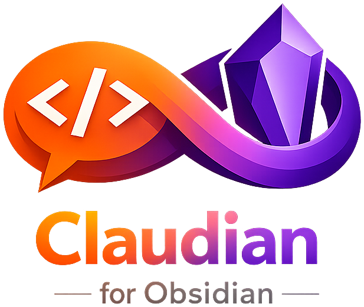

<p align="center">
  
</p>

<h1 align="center">Qlaude</h1>
<p align="center"><em>Claude Code, inside Obsidian.</em></p>

<p align="center">
  <a href="https://github.com/ziadkadry99/Qlaude/releases/latest"></a>
  
  
</p>

---

Qlaude is an Obsidian plugin that brings the full power of the [Claude Code CLI](https://docs.anthropic.com/en/docs/claude-code) into your vault. Open a modal with a keyboard shortcut, type a natural-language instruction, and watch Claude read, edit, and create notes in real time — all streamed live as it works.

## Features

- **Quick action mode** — one-shot prompt with live streaming output; textarea locks when done
- **Chat mode** — multi-turn conversation with persistent history across modal opens and Obsidian sessions; resumable via `--resume`
- **Markdown rendering** — Claude's output renders with proper headings, lists, bold, code blocks, and more
- **Animated loading indicator** — bouncing dots show when Claude is working
- **Model selection** — type any Claude model ID (e.g. `claude-haiku-4-5`, `claude-sonnet-4-6`, `claude-opus-4-6`)
- **Granular permissions** — independently control read, list, edit, and create access
- **Wikilink-aware** — Claude understands `[[wikilinks]]`, YAML frontmatter, and Obsidian conventions

## Demo

> Open the modal with `Cmd+Shift+C`, type your instruction, and press `Ctrl+Enter` to run.

## Requirements

- **Obsidian** 1.4.0 or later (desktop only)
- **Claude Code CLI** installed and authenticated — [install guide](https://docs.anthropic.com/en/docs/claude-code/getting-started)
  - Verify with: `claude --version`

## Installation

### From Obsidian (once listed in community plugins)

1. Open **Settings → Community plugins → Browse**
2. Search for **Qlaude**
3. Click **Install**, then **Enable**

### Manual installation

1. Download `main.js`, `manifest.json`, and `styles.css` from the [latest release](https://github.com/ziadkadry99/Qlaude/releases/latest)
2. Copy them to `<vault>/.obsidian/plugins/qlaude/`
3. In Obsidian: **Settings → Community plugins → Enable Qlaude**

## Usage

### Quick action

1. Open any note and press `Cmd+Shift+C`
2. Make sure the **Quick action** tab is selected
3. Type your instruction, e.g.:
   - *"Summarise this note in three bullet points and add them at the top"*
   - *"Convert all plain list items to checkboxes"*
4. Press `Ctrl+Enter` (or `Cmd+Enter`) to run

Claude streams its response live with markdown rendering. The textarea locks when done to make the output easy to read.

### Chat

1. Open the modal and click the **Chat** tab
2. Type a message and press `Ctrl+Enter` to send
3. Claude responds in a conversation thread — your messages appear as bubbles on the right, Claude's replies render below
4. Send follow-up messages freely; Claude remembers the full context of the conversation
5. Click **Clear** to start a fresh conversation

Chat history and the session ID persist between modal opens and Obsidian restarts until you click Clear.

## Configuration

Go to **Settings → Qlaude** to configure:

| Setting | Default | Description |
|---|---|---|
| Claude binary path | `claude` | Full path to the `claude` binary if not on Obsidian's PATH |
| Model | `claude-haiku-4-5` | Any model ID supported by the CLI (e.g. `claude-sonnet-4-6`, `claude-opus-4-6`) |
| Clear chat on start | Off | Wipe chat history and session automatically when Obsidian launches |

## Permissions

Qlaude uses Claude Code's `--allowedTools` flag to enforce tool-level permissions at the CLI — Claude cannot use a tool that isn't explicitly enabled regardless of what it's asked to do. Read access is further restricted via the system prompt.

By default Claude can only read the **currently active file**. Enable permissions progressively as needed:

| Permission | Default | What it enables |
|---|---|---|
| Read entire vault | Off | Read any file in the vault |
| List vault structure | Off | `Glob`, `Grep`, `LS` — search and list files |
| Edit current file | Off | `Edit` — modify the currently active file only |
| Edit any file | Off | `Edit`, `Write` — modify any file in the vault |
| Create files | Off | `Write` — create new files |

## Building from source

```bash
git clone https://github.com/ziadkadry99/Qlaude
cd Qlaude
npm install
npm run build   # produces main.js
```

## License

MIT — see [LICENSE](LICENSE)
