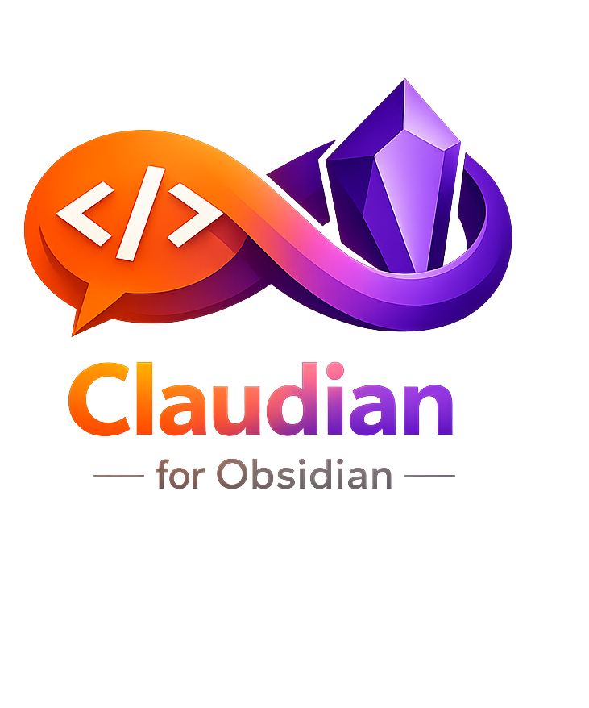

<p align="center">
  
</p>

<h1 align="center">Claudian</h1>
<p align="center"><em>Claude Code, inside Obsidian.</em></p>

<p align="center">
  <a href="https://github.com/ziadkadry99/claudian/releases/latest"></a>
  
  
</p>

---

Claudian is an Obsidian plugin that brings the full power of the [Claude Code CLI](https://docs.anthropic.com/en/docs/claude-code) into your vault. Open a modal with a keyboard shortcut, type a natural-language instruction, and watch Claude read, edit, and create notes in real time — all streamed live as it works.

## Features

- **Natural-language editing** — describe what you want in plain English; Claude handles the rest
- **Live streaming output** — see Claude's thinking and tool calls as they happen
- **Collapsible tool cards** — inspect every file read/write in a clean, expandable UI
- **Granular permissions** — independently control whether Claude can list vault structure, edit files, or create new ones
- **Wikilink-aware** — Claude understands `[[wikilinks]]`, YAML frontmatter, and Obsidian conventions

## Demo

> Open the modal with `Cmd+Shift+C`, type your instruction, and press `Ctrl+Enter` to run.

## Requirements

- **Obsidian** 1.4.0 or later (desktop only)
- **Claude Code CLI** installed and authenticated — [install guide](https://docs.anthropic.com/en/docs/claude-code/getting-started)
  - Verify with: `claude --version`

## Installation

### From Obsidian (once listed in community plugins)

1. Open **Settings → Community plugins → Browse**
2. Search for **Claudian**
3. Click **Install**, then **Enable**

### Manual installation

1. Download `main.js`, `manifest.json`, and `styles.css` from the [latest release](https://github.com/ziadkadry99/claudian/releases/latest)
2. Copy them to `<vault>/.obsidian/plugins/claudian/`
3. In Obsidian: **Settings → Community plugins → Enable Claudian**

## Configuration

Go to **Settings → Claudian** to configure:

| Setting | Default | Description |
|---|---|---|
| Claude binary path | `claude` | Full path to the `claude` binary if not on Obsidian's PATH (e.g. `/Users/you/.local/bin/claude`) |
| List vault structure | Off | Allow Glob, Grep, and LS tools |
| Edit current file | Off | Allow editing the currently active file |
| Edit any file | Off | Allow editing any file in the vault |
| Create files | Off | Allow creating new files |

## Usage

1. Open any note
2. Press `Cmd+Shift+C` (or configure a custom hotkey)
3. Type your instruction, e.g.:
   - *"Summarise this note in three bullet points and add them at the top"*
   - *"Find all notes tagged #todo and list them here"*
   - *"Convert all plain list items to checkboxes"*
4. Press `Ctrl+Enter` (or `Cmd+Enter`) to run

Claude streams its output live. Each file operation appears as a collapsible tool card you can inspect.

## Permissions

Claudian uses Claude Code's `--allowedTools` flag to enforce permissions at the CLI level — Claude cannot use a tool that isn't explicitly enabled, regardless of what it's asked to do.

| Permission | Tools granted |
|---|---|
| (always) | `Read` |
| List vault structure | `Glob`, `Grep`, `LS` |
| Edit current file | `Edit` |
| Edit any file | `Edit`, `Write` |
| Create files | `Write` |

## Building from source

```bash
git clone https://github.com/ziadkadry99/claudian
cd claudian
npm install
npm run build   # produces main.js
```

## License

MIT — see [LICENSE](LICENSE)
